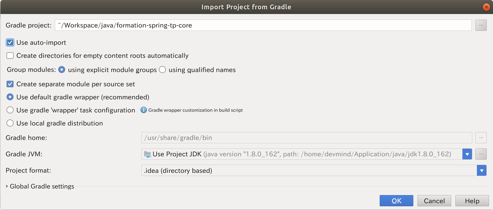

= TP formation Spring Core

image:https://www.dev-mind.fr/img/logo/logo_1500.png[Dev-Mind]

Ce projet contient le minimum de configuration pour initier un projet Spring dans le cadre de la formation Spring Framework de Dev-Mind.

== Prérequis

Avant de commencer cette formation vous devez avoir certains prérequis

* certaines bases en Java et JEE
* maîtriser les tests unitaires en Java
* avoir des connaissances en Web
* connaître JDBC voir Hibernate
* avoir des notions de Git

Au niveau de votre poste de travail, vous devez avoir

* une version de Java 1.8+ http://www.oracle.com/technetwork/java/javase/downloads/jdk8-downloads-2133151.html[download]
* un IDE pour faciliter le développement comme IntelliJ https://www.jetbrains.com/idea/download[download] (vous pouvez utiliser la version communautaire ou essayer la version ultimate le temps de la formation)
* une version de git en local https://git-scm.com/downloads[download]

== Installation

=== Recuperation du projet

Pour récupérer le projet vous devez lancer la commande git suivante

```
git clone https://github.com/Dev-Mind/formation-spring-tp.git
```

=== Ouverture dans IDE

Dans IntelliJ allez dans "File" + "Open"

La fenêtre suivante s'ouvre 



Faites en sorte d'avoir les mêmes paramètres et cliquez sur le bouton OK. L'IDE va configurer votre projet

=== En ligne de commande

Une fois récupéré allez dans le répertoire ou le projet a été installé et lancez la commande

```
.gradlew clean build
```

ou sous Windows

```
gradlew clean build
```

Si vous ne connaissez pas,  https://gradle.org/[Gradle] est un outil facilitant la construction des projets Java. C'est équivalent à Maven même si je trouve cette solution beaucoup plus souple. Gradle va télécharger toutes les dependances de notre projet en automatique et préconfigurer notre environnement de développement.
